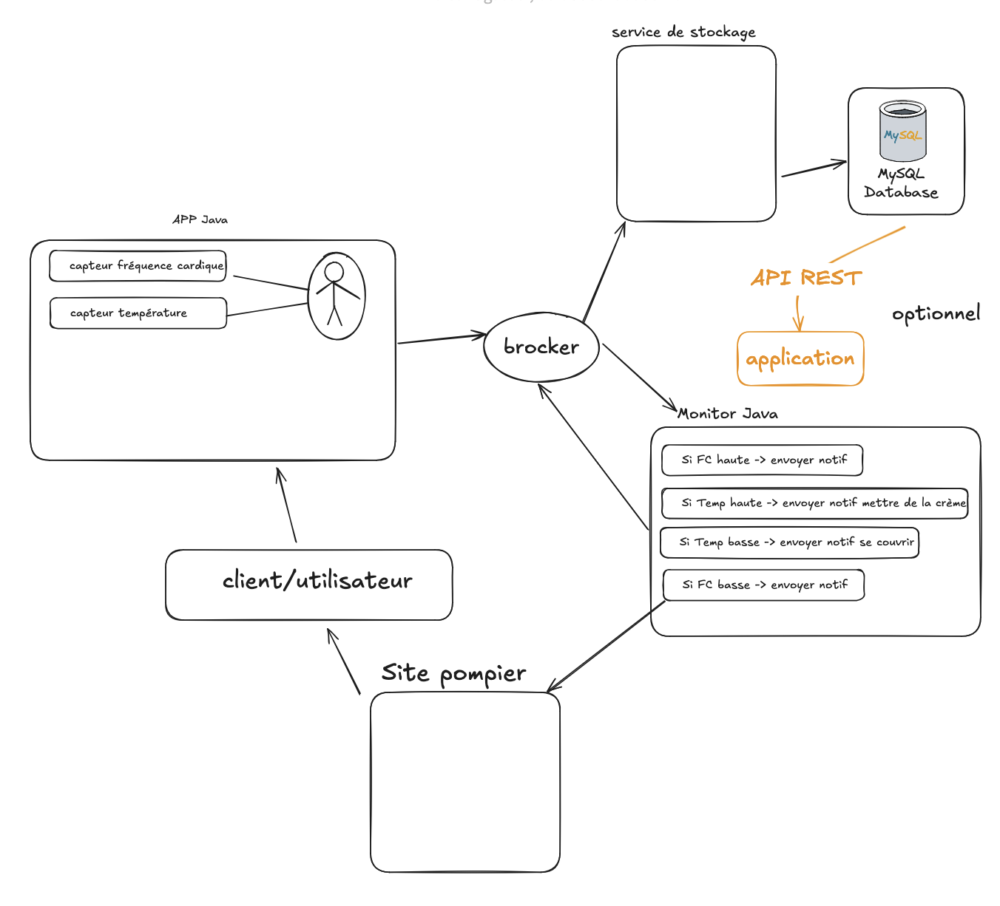

# Connected-House
infrastructure IT (practicing)

### IOT heart sensor

bpt = 0 = Alert 
temperature > = alter 

collaborative :  

## Project Structure

https://excalidraw.com/#room=2ceef69c678c276b7b80,xi3QUamN1P-3FMKsHWbhpg

we are using a brocker named 

  

## done work :

- [x] java pub class
- [x] java sub class
- [x] java Watch
- [x] java WatchMO
- [x] java postgreConnetion (singleton)
- [x] java mysqlConnection (singleton)
- [x] using jdk 17 to compile classes
- [x] brocker rabbitmq
  - [x] inform the user
- [ ] inform firefighter 🔥 
  - [ ] postgres + pgAdmin failed
  - [ ] mysql + phpmyadmin failed

<!--end-->
